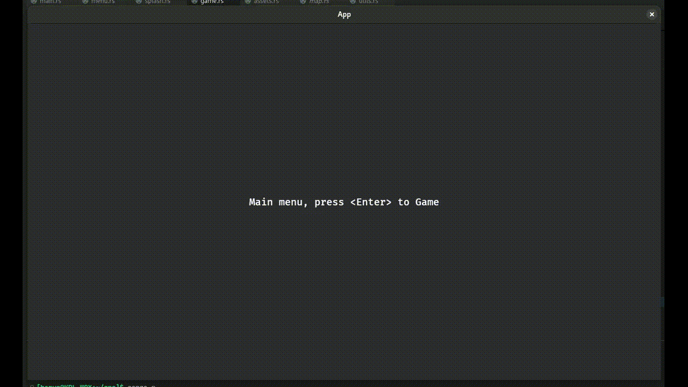

# 2025-03-23_4
## pl
W tym tygodniu kilka małych rzeczy w kodzie. Ogólnie postęp jest nieduży względem zeszłego tygodnia, bo miałem dość zajęty weekend.

Ograniczyłem prędkość ataku. Poprzednio spamowało pociskami w każdej klatce, teraz jest to ustawione 2Hz (2 razy na sekundę).

Wprowadziłem obsługę "życia" pocisku. Nie będą teraz one leciały w eter i spowaliały grę z każdym kolejnym strzałem, ale będą niszczone po sekundzie (wartość tymczasowa).

Ujednoliciłem też w kodzie logikę stanu postaci: czy dashuje, czy atakuje, czy nie.
Teraz też atakując postać jest spowolniona do 75%.

Poza tym, tak jak w sumie co tydzień, dalej kontynuowałem ogólną naukę.

Z racji, że już to prawie wygląda jak gra, poniżej gif z prostym demo tego poruszania się, rozglądania się, dashowania i strzelania:\
\
(słaba jakość i artefakty na tym obrazku spowodowane są kompresją i konwersją). 

Planów na najbliższy tydzień brak - zobaczymy gdzie mnie poniesie.

## en
*maybe someday*
